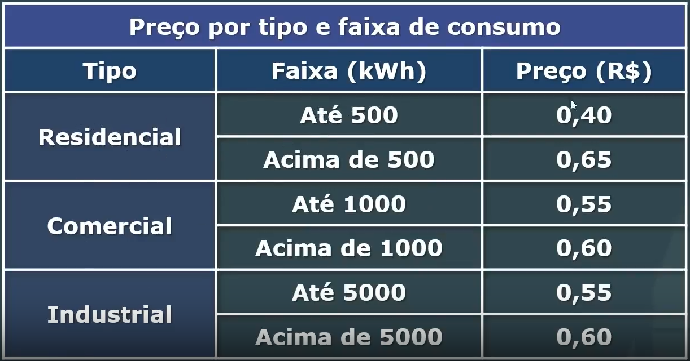

Write a program that calculates the price to be paid for electricity supply. Ask for the amount of kWh consumed and the type of installation: R for residences, I for industries, and B for businesses.

Calculate the price according to the table below:

